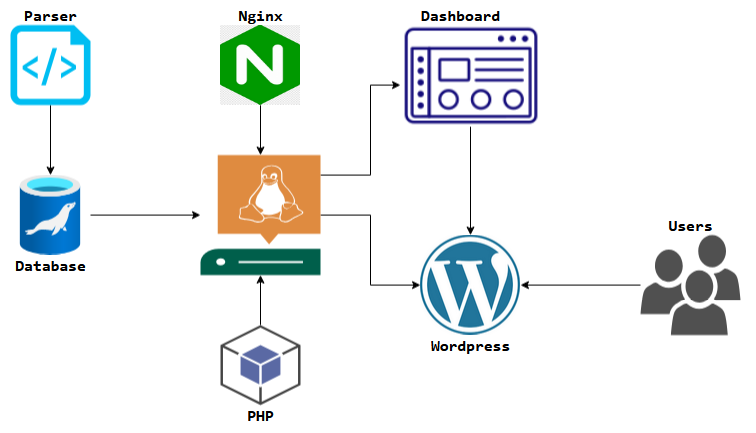

## Info repository



### Linux
* https://www.linux.org
* https://books.linuxforum.ru/wp-content/files/Linux-handbook-comands-A-Z-SEDICOMM-University.pdf
* https://linuxsimply.com/linux-basics/os-installation/virtual-machine/ubuntu-on-vmware/
* https://www.digitalocean.com/community/tutorials/how-to-use-ssh-to-connect-to-a-remote-server

### Nginx, MySQL, PHP, Wordpress
* https://nginx.org/en
* https://mariadb.org/
* https://www.php.net/
* https://wordpress.org/
* https://www.digitalocean.com/community/tutorials/how-to-install-wordpress-with-lemp-on-ubuntu-22-04
* https://www.digitalocean.com/community/tutorials/how-to-create-a-self-signed-ssl-certificate-for-nginx-in-ubuntu-20-04-1
* https://www.scalahosting.com/kb/why-is-my-localhost-wordpress-so-slow/
* https://www.digitalocean.com/community/tutorials/how-to-set-up-nginx-server-blocks-virtual-hosts-on-ubuntu-16-04

### REST API
To publish a post on a WordPress site using the REST API with PHP, you can follow the example code provided below. This code demonstrates how to send a POST request to the WordPress REST API to create a new post.

### Using PHP

```php

<?php

// Replace these values with your own
$site_url = 'http://example.com'; // Your WordPress site URL
$api_key = 'your-api-key'; // Your API key or application password

// Set up the API request URL
$url = $site_url . '/wp-json/wp/v2/posts';

// Set up the headers for the request
$headers = array(
    'Content-Type: application/json',
    'Authorization: Bearer ' . $api_key // Use Bearer token for authentication
);

// Set up the post data
$data = array(
    'title' => 'My New Post', // Title of the post
    'content' => 'This is the content of my new post.', // Content of the post
    'status' => 'publish' // Status can be 'publish', 'draft', etc.
);

// Initialize cURL
$ch = curl_init();
curl_setopt($ch, CURLOPT_URL, $url);
curl_setopt($ch, CURLOPT_POST, true);
curl_setopt($ch, CURLOPT_HTTPHEADER, $headers);
curl_setopt($ch, CURLOPT_POSTFIELDS, json_encode($data));
curl_setopt($ch, CURLOPT_RETURNTRANSFER, true);

// Execute the request
$response = curl_exec($ch);

// Check for errors
if (curl_errno($ch)) {
    echo 'Error:' . curl_error($ch);
} else {
    // Print the response
    print_r(json_decode($response, true));
}

// Close cURL session
curl_close($ch);
?>

```

#### Explanation of the Code
* <b>Site URL and API Key:</b> Replace http://example.com with your WordPress site URL and your-api-key with your actual API key or application password.
* <b>API Endpoint:</b> The endpoint for creating posts is /wp-json/wp/v2/posts.
* <b>Headers:</b> The Content-Type is set to application/json, and the Authorization header includes the Bearer token for authentication.
* <b>Post Data:</b> The $data array contains the title, content, and status of the post. You can modify these fields as needed.
* <b>cURL Initialization:</b> The script initializes a cURL session, sets the necessary options, and executes the request.
* <b>Response Handling:</b> After executing the request, the response is checked for errors and printed in a readable format.

#### Additional Notes
* Ensure that the WordPress REST API is enabled on your site and that you have the necessary permissions to create posts.
* You can add more fields to the <b>$data</b> array, such as <b>excerpt</b>, <b>categories</b>, or <b>tags</b>, depending on your requirements

### Using cURL
To publish a post on a WordPress site using a cURL POST request with an authentication token, you can follow the example below. This example demonstrates how to send a POST request to the WordPress REST API to create a new post while including an authentication token in the request headers.

```bash

curl -X POST https://example.com/wp-json/wp/v2/posts \
-H "Content-Type: application/json" \
-H "Authorization: Bearer your_access_token" \
-d '{
    "title": "My New Post",
    "content": "This is the content of my new post.",
    "status": "publish"
}'

```

#### Explanation of the Command
* <b>-X POST:</b> This flag specifies that you are making a POST request.
* <b>https://example.com/wp-json/wp/v2/posts:</b> Replace https://example.com with your actual WordPress site URL. This is the endpoint for creating posts.
* <b>-H "Content-Type: application/json":</b> This header indicates that the data being sent is in JSON format.
* <b>-H "Authorization: Bearer your_access_token":</b> Replace your_access_token with your actual Bearer token. This token is used for authenticating the request.
* <b>-d '{...}':</b> This flag is used to send the data payload. The JSON object contains the title, content, and status of the post. You can modify these fields as needed.

#### Additional Notes
* Ensure that the WordPress REST API is enabled on your site and that you have the necessary permissions to create posts.
* The <b>status</b> field can be set to <b>publish</b>, <b>draft</b>, or other valid statuses depending on your requirements.
* If you encounter issues, make sure that your token is valid and that your user has the appropriate permissions to create posts on the WordPress site

### Links:
* https://wordpress.org/plugins/oauth2-provider/#description
* https://www.cloudways.com/blog/wp-rest-api-oauth-authentication/
